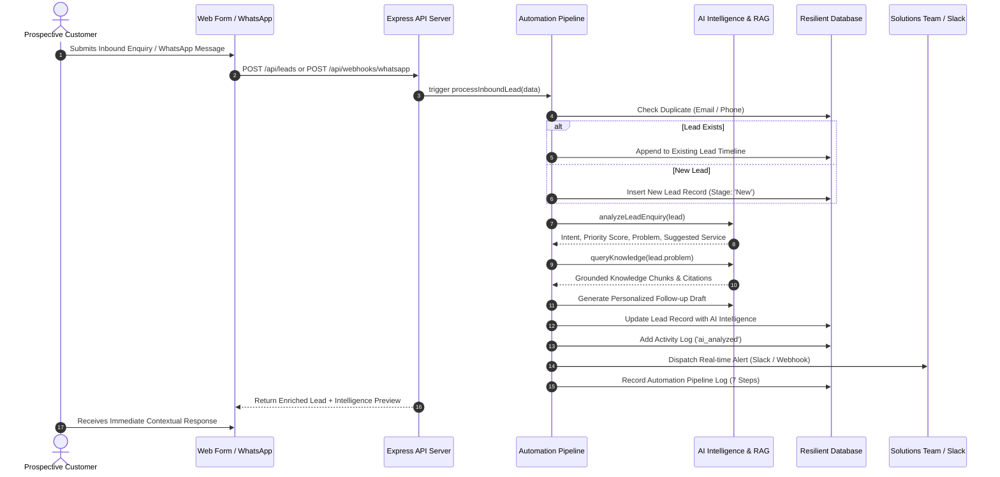

# System Architecture & Technical Specifications

**Candidate:** Chirag N Sundar  
**Role:** AI Full-Stack Developer  
**Company:** Quantum Weave | BrandMint AI  
**Project:** AI-Powered Lead & Customer Intelligence System (OmniLead AI)

---

## 1. High-Level Architecture Diagram

```
+----------------------------------------------------------------------------------------------------+
|                                    INBOUND INGESTION CHANNELS                                      |
+----------------------------------------------------------------------------------------------------+
       |                                                                            |
       v                                                                            v
[ Public Web Portal ]                                                    [ WhatsApp Cloud API / ]
[ Inbound Enquiry Form ]                                                 [ Webhook Simulator   ]
       |                                                                            |
       +------------------------------------+---------------------------------------+
                                            |
                                            v
+----------------------------------------------------------------------------------------------------+
|                                     EXPRESS API SERVER (Node.js)                                   |
+----------------------------------------------------------------------------------------------------+
|                                                                                                    |
|  [ Routes Layer ]                                                                                  |
|    • /api/leads (CRUD, Stage Transitions, Follow-up Approvals)                                     |
|    • /api/knowledge (Document Ingestion, Semantic Vector Query)                                     |
|    • /api/agent (Structured Tool Execution, Autonomous Reasoning)                                  |
|    • /api/automations (Event Pipeline Trigger, Step Execution Logs)                                |
|    • /api/webhooks (Meta Webhook Handshake, Inbound Payload Parser)                                 |
|    • /api/analytics (Pipeline KPI Aggregation, Conversion Funnel)                                  |
|                                                                                                    |
|  [ Event-Driven Automation Pipeline ]                                                              |
|    1. Lead Capture & Normalization                                                                 |
|    2. Duplicate Lead Detection & Merging (by Email / Phone)                                        |
|    3. AI Lead Intelligence Evaluation                                                              |
|    4. Semantic RAG Knowledge Enrichment                                                            |
|    5. Hyper-Personalized Follow-up Generation                                                      |
|    6. Team Notification & Webhook Dispatch (Slack / Email)                                         |
|    7. Audit Trail Logging                                                                          |
|                                                                                                    |
|  [ Core Intelligence Engines ]                                                                     |
|    • AI Service: Cloud LLM (Gemini 1.5 Flash / OpenAI) + Deterministic Semantic Fallback Engine    |
|    • RAG Service: Semantic Chunking, Inverted Index, TF-IDF Vector Space, Cosine Similarity        |
|    • Agent Service: Function/Tool Calling (query_kb, check_crm, update_lead, schedule_slot, esc)   |
|    • Webhook Service: Meta Webhook Verification & Outbound Dispatch                                |
|                                                                                                    |
|  [ Resilient Data Layer ]                                                                          |
|    • ACID Atomic File-Persisted Database (`quantum_weave_db.json`)                                 |
|    • Seed Collections: Leads, Activities, Knowledge Documents, Automation Logs, Team Users         |
+----------------------------------------------------------------------------------------------------+
                                            |
                                            v
+----------------------------------------------------------------------------------------------------+
|                                   REACT CLIENT APPLICATION (Vite)                                  |
+----------------------------------------------------------------------------------------------------+
|  • Public Portal: Quantum Weave Showcase, ROI Pricing Calculator, Interactive Enquiry Form         |
|  • Lead Intelligence Hub: KPI Cards, Queue Ticker, Stage Filters, Search                           |
|  • Pipeline Board: 6-Stage Kanban Board (New -> Contacted -> Qualified -> Proposal -> Won / Lost)  |
|  • Lead Detail Dossier: AI Summary, Pain Point, Commercial Intent, Priority, Follow-Up Composer   |
|  • Knowledge Hub: Document Management, Chunk Viewer, Grounded Q&A Playground with Citations        |
|  • Agent Studio: Conversational Sandbox with Live Function Calling Trace Inspector                 |
|  • Automation Hub: Visual Workflow Flowchart & Real-Time Execution Step Inspector                  |
|  • WhatsApp Lab: Interactive Smartphone Simulator + Meta Cloud API Architecture Specs             |
|  • Analytics Dashboard: Stage Funnel, Priority Heatmap, Source Breakdown                           |
+----------------------------------------------------------------------------------------------------+
```

---

## 2. End-to-End Data & Execution Flow



---

## 3. Component Deep-Dives

### 3.1 AI Lead Intelligence Engine
- **Objective:** Turn freeform customer inquiries into actionable structured business data without requiring a standalone chatbot.
- **Fields Extracted:**
  - `summary`: Two-sentence crisp executive overview of the inquiry.
  - `problem`: Underlying operational pain point (e.g., support volume overwhelm, scattered PDFs, manual lead qualification).
  - `intent`: Classified commercial intent (*High Commercial Intent*, *Enterprise Evaluation*, *Mid-Market Automation*, *Exploratory / Small Business*).
  - `priority`: Designated as *Urgent*, *High*, *Medium*, or *Low* with transparent multi-factor reasoning.
  - `suggestedService`: Direct match with Quantum Weave's offerings.
  - `recommendedNextAction`: Concrete next step for the sales/solutions engineer.
  - `suggestedFollowUp`: Personalized ready-to-send draft email or WhatsApp message.
- **Resilience Design:** If external API keys (Gemini / OpenAI) are absent or rate-limited, the system seamlessly uses its deterministic semantic heuristic engine, ensuring zero downtime or broken flows.

### 3.2 Grounded RAG Knowledge Base
- **Chunking:** Semantic boundary chunking (300-500 tokens) with sentence preservation and metadata retention (`docTitle`, `category`).
- **Vector Space:** Inverted document frequency (IDF) weighted term vectors normalized under L2 Euclidean norm for cosine similarity scoring.
- **Guardrails:** If maximum retrieval score is below threshold (0.15), the system declines to hallucinate and provides a polite fallback offering direct human engineer contact.

### 3.3 Autonomous AI Agent (Structured Tool Calling)
The agent operates with 5 callable application tools:
1. `query_knowledge_base`: Retrieves grounded facts, pricing, and architectures.
2. `check_lead_status`: Queries existing pipeline status and interaction history.
3. `create_or_update_lead`: Persists prospect records directly to the CRM.
4. `schedule_consultation`: Allocates calendar discovery slots and logs timeline events.
5. `escalate_to_human`: Flags mission-critical accounts for immediate senior review.

Every turn produces a transparent **Tool Execution Trace** detailing tool name, arguments, output payload, and millisecond execution latency.

### 3.4 Event-Driven Automation Pipeline
The pipeline executes a 7-step transactional workflow on every inbound inquiry:
1. `Lead Captured & Validated`
2. `Duplicate Detected & Merged`
3. `AI Lead Intelligence Analysis`
4. `Knowledge Base Context Retrieved (RAG)`
5. `Personalized Follow-Up Drafted`
6. `Team Notification / Webhook Dispatched`
7. `Record Complete Automation Log`
